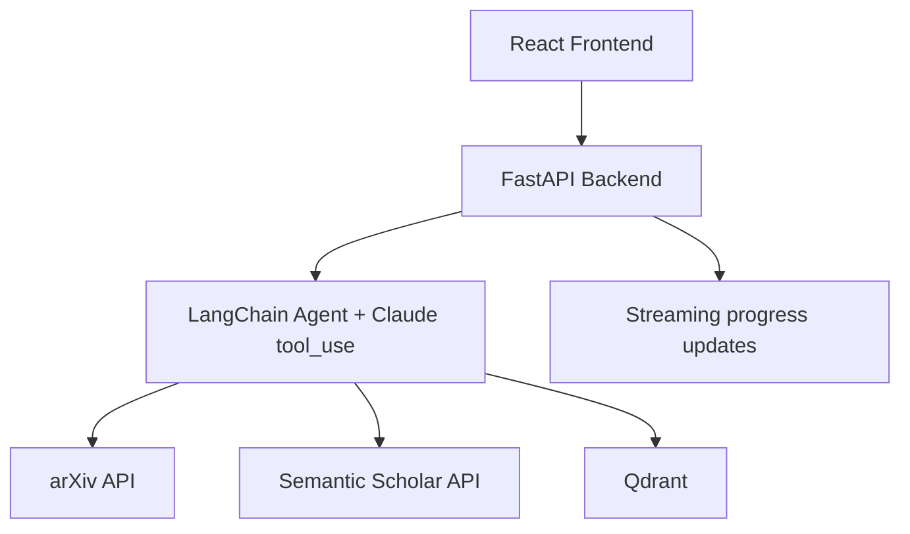

# Technical Specification

AI Autonomous Research Assistant

This document is the build reference for the project. It combines product goals, implementation constraints, API and data contracts, algorithm decisions, UI/UX requirements, and assistant-specific rules for Cursor, Gemini Code Assist, and GitHub Copilot.

Use this file as the source of truth when planning, implementing, or reviewing changes.

## 1. Product Brief

### Problem Statement

Researchers spend a large portion of project time on manual literature review. Reference managers help organize sources, but they do not autonomously search, rank, cluster, and synthesize papers into a usable review.

### Target Users

| User | Core Need |

|---|---|
| Graduate and PhD students | Fast baseline literature review |
| Academic researchers | Thematic synthesis across many papers |
| R&D engineers | Rapid state-of-the-art scan |

### Core User Stories

| ID | As a... | I want to... | So that... |

|---|---|---|---|
| US-01 | Researcher | Enter a free-text topic | The agent starts automatically |
| US-02 | Researcher | See progress and reasoning steps | I trust the paper selection |
| US-03 | Researcher | Receive a structured review with background, methods, findings, and gaps | I can use it directly in writing |
| US-04 | Researcher | Adjust paper count between 5 and 20 | The output matches my depth requirement |
| US-05 | Researcher | Export Markdown or DOCX | I can edit the result offline |

## 2. Product Requirements

### Functional Requirements

| ID | Requirement |

|---|---|
| FR-01 | Accept topic input with at least 3 words and no more than 200 characters |
| FR-02 | Query arXiv and Semantic Scholar concurrently |
| FR-03 | Rank papers by LLM relevance scoring using title and abstract |
| FR-04 | Extract paper metadata and key findings for each selected paper |
| FR-05 | Generate a structured review with introduction, paper summary, findings by theme, research gaps, and conclusion |
| FR-06 | Stream progress updates during the workflow |
| FR-07 | Store session state in memory in v1 |
| FR-08 | Support regeneration with different parameters such as paper count and recency |

### Non-Functional Requirements

| ID | Requirement | Target |

|---|---|---|
| NFR-01 | Performance | Full workflow should complete within 45 seconds for 10 papers |
| NFR-02 | Usability | Zero clicks after topic submission |
| NFR-03 | Scalability | Support 50 concurrent users on a 2 vCPU / 4 GB environment |
| NFR-04 | Security | API keys must remain environment-managed and never reach the frontend |
| NFR-05 | Reliability | The system should degrade gracefully if one search source fails |

### Success Metrics

| KPI | Target |

|---|---|
| Task completion rate | At least 95% of valid topics produce a review |
| User satisfaction | At least 4/5 on review usefulness |
| Session time | Under 2 minutes including reading output |
| Agent autonomy | No human intervention required for retrieval and summarisation |

## 3. Technical Architecture

### System Overview



### Technology Stack

| Layer | Technology | Notes |

|---|---|---|
| Backend | Python 3.11 + FastAPI | Uvicorn ASGI |
| AI Orchestration | LangChain v0.3 + Claude API | Use tool_use; default model: claude-sonnet-4-20250514 |
| Vector Store | Qdrant | In-memory for dev, persistent volume for prod |
| Search APIs | arXiv REST + Semantic Scholar | arXiv has no auth; Semantic Scholar may use an optional key |
| Frontend | React 18 + Vite + TailwindCSS | Use Zustand and shadcn/ui |
| Output | react-markdown + remark-gfm | Render tables, citations, and exportable Markdown |

### Recommended Project Structure

```text
ai-research-assistant/
├── backend/
│   ├── main.py
│   ├── agent/
│   │   ├── orchestrator.py
│   │   ├── tools.py
│   │   └── prompts.py
│   ├── models/
│   │   ├── paper.py
│   │   └── session.py
│   ├── services/
│   │   ├── arxiv.py
│   │   ├── semantic_scholar.py
│   │   └── qdrant.py
│   ├── requirements.txt
│   └── .env.example
├── frontend/
│   ├── src/
│   │   ├── components/
│   │   ├── store/
│   │   └── App.tsx
│   ├── package.json
│   └── vite.config.ts
└── docker-compose.yml
```

## 4. Data Contracts

### Core Models

```python
class Paper(BaseModel):
    id: str
    title: str
    authors: list[str]
    year: int
    abstract: str
    pdf_url: str | None
    source: Literal["arxiv", "semantic_scholar"]
    relevance_score: float
    key_findings: str | None


class ReviewDraft(BaseModel):
    topic: str
    papers_used: list[Paper]
    generated_at: datetime
    sections: dict[str, str]
    full_markdown: str
```

### API Endpoints

| Method | Endpoint | Request Body | Response |

|---|---|---|---|
| POST | /api/research/start | `{topic, max_papers}` | `{session_id}` |
| GET | /api/research/status/{id} | None | `{status, progress, current_step}` |
| GET | /api/research/result/{id} | None | `ReviewDraft` |
| POST | /api/research/regenerate | `{session_id, params}` | `ReviewDraft` |

### Environment Variables

```env
CLAUDE_API_KEY=sk-ant-...
SEMANTIC_SCHOLAR_API_KEY=
QDRANT_URL=http://localhost:6333
QDRANT_API_KEY=
```

## 5. Workflow and Algorithms

### Agent Step Sequence

1. Plan the search terms from the topic.
2. Search arXiv and Semantic Scholar concurrently.
3. Merge and deduplicate by DOI or arXiv ID.
4. Rank papers with batched LLM scoring, 5 papers per call.
5. Keep the top-K papers.
6. Create embeddings from abstracts and store them in Qdrant.
7. Cluster papers with HDBSCAN.
8. Extract key findings for each paper.
9. Synthesize the final literature review.

### Algorithm Decisions

#### A1. Multi-Source Search and Deduplication

```text
Input: topic T, max_papers K (default 10)
1. Query arXiv with limit K*2
2. Query Semantic Scholar with limit K*2
3. Merge results
4. Deduplicate by DOI or arXiv ID
5. Keep the highest relevance score when duplicates exist
Complexity: O(|A| + |S|)
```

#### A2. LLM Relevance Scoring

```text
Prompt template:
Rate relevance from 1 to 10 for topic "{topic}".
Use title and abstract only.
Return only the integer score.

Operational rule:
Batch 5 papers per call to control latency and token use.
```

#### A3. Thematic Clustering

```text
1. Embed each abstract
2. Upsert embeddings into Qdrant
3. Run HDBSCAN with min_cluster_size = 2
4. Mark outliers with cluster id -1
5. Use Claude to label each cluster theme
```

#### A4. Review Synthesis

The final review should include these sections:

- Introduction
- Summary of Included Papers
- Key Findings by Theme
- Research Gaps
- Conclusion

Use academic tone, inline citations, and a Markdown table for the summary section.

#### A5. Optional PDF Extraction

This is a later-phase enhancement. If implemented, it should:

1. Download the PDF
2. Extract the first pages with `pypdf`
3. Chunk the text into manageable segments
4. Use Claude for deeper findings extraction

## 6. UI/UX Specification

### Design Principles

| Principle | Implementation |

|---|---|
| Minimalist | One primary action after topic input |
| Wide-screen first | Side-by-side panels with `max-w-screen-2xl mx-auto px-8` |
| Progressive disclosure | Hide paper details until the user expands them |
| Trust-building | Show agent status at every step |

### Layout Requirements

- Input panel on the left, output panel on the right on desktop.
- Stack panels on tablet-sized screens.
- Show a desktop-only warning or reduced mode on small screens.
- Keep loading, error, and completed states visually distinct.

### Component Requirements

| Component | Library |

|---|---|
| Topic input | shadcn/ui Input |
| Paper count control | shadcn/ui Slider |
| Progress display | Radix UI Progress or equivalent |
| Markdown output | react-markdown + remark-gfm |
| Loading state | shadcn/ui Skeleton |
| Errors | Inline error banner with retry action |
| Notifications | shadcn/ui Toast |

### Accessibility Requirements

- All interactive elements need accessible labels.
- Progress updates should be announced with `aria-live`.
- Keyboard navigation must cover topic input, controls, submit, and export actions.
- Contrast should meet WCAG 2.1 AA.
- Support light mode by default and optional dark mode via CSS variables.

## 7. Implementation Rules for AI Coding Tools

### Cursor

- Start from the closest file or symbol that owns the behavior.
- Make the smallest valid change that fixes the issue or adds the feature.
- Avoid broad refactors unless the code path clearly requires them.
- Check nearby tests or call sites before editing shared logic.

### GitHub Copilot

- Accept async completions only after verifying they do not introduce blocking calls.
- Reject completions that add `requests` to async code.
- Prefer typed models and explicit returns.
- Use logging instead of temporary `print()` debugging.

### Gemini Code Assist

- When explaining changes, note the Claude token and batch-size impact if prompt behavior changes.
- Prefer `asyncio.gather()` for independent concurrent work.
- Include Args, Returns, Raises, and Example blocks when generating docstrings.
- Keep dependency changes pinned and justified.

## 8. Development Constraints

- Use async I/O for network and file-adjacent operations where practical.
- Keep retry logic around external APIs.
- Read secrets from environment variables only.
- Do not log secrets, full paper content, or user topics at info level.
- Keep session data isolated per run.
- Keep prompt templates and model settings stable unless the task explicitly changes them.
- Use structured outputs wherever downstream code consumes model output.

## 9. Prioritised Feature List

| Priority | Feature | Description |

|---|---|---|
| P0 | Topic submission | Free-text input with validation |
| P0 | Multi-source search | Concurrent arXiv and Semantic Scholar retrieval |
| P0 | LLM relevance ranking | Score papers from 1 to 10 |
| P0 | Key finding extraction | Per-paper bullet summary via Claude |
| P0 | Literature review generation | Structured Markdown with themes and citations |
| P1 | Progress streaming | Step-by-step updates in the UI |
| P1 | Adjustable paper count | User-selectable paper range |
| P1 | Export | Markdown download and copy support |
| P2 | Research gap detection | Open questions inferred from the paper set |
| P2 | Citation graph | Reference network from Semantic Scholar data |
| P3 | Session history | Lightweight storage of past sessions |

## 10. Deployment Notes

| Mode | Method |

|---|---|
| Development | `docker-compose up` for FastAPI, Qdrant, and the React dev server |
| Production | Serve the frontend separately or build it into the backend deployment, with Qdrant on persistent storage |

## 11. Open Questions

- Should session history remain in-memory in v1, or do you want SQLite added next?
- Should export support DOCX in the first implementation pass or remain Markdown-only?
- Should the UI stay desktop-first, or should mobile support be upgraded now?

## 12. Definition of Done

The project is in a good build state when:

- the topic submission flow works end-to-end
- search, ranking, extraction, and synthesis are all async and testable
- the UI shows progress and final output clearly
- the generated review is reproducible from the same input and config
- the README and this spec match the shipped behavior
