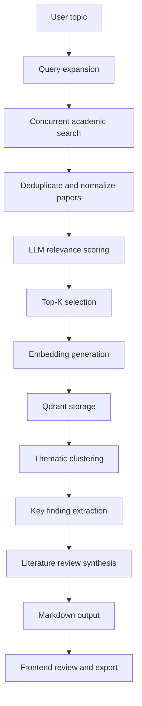

# Arxara

## AI Autonomous Research Assistant

[](https://opensource.org/licenses/MIT)
[](https://www.python.org/downloads/)
[](https://fastapi.tiangolo.com)
[](https://react.dev)
[](https://qdrant.tech/)

An autonomous research workflow that turns a topic into a structured academic literature review.
The system searches academic sources, ranks papers by relevance, extracts key findings, clusters related work, and synthesizes a polished Markdown review with citations and research gaps.

## Highlights

- Concurrently searches arXiv and Semantic Scholar for candidate papers.
- Ranks papers with an LLM-based relevance scorer.
- Extracts paper-level findings with Claude using structured tool calls.
- Clusters papers by theme using embeddings and HDBSCAN.
- Generates a clean literature review ready for export.
- Provides a React dashboard for tracking progress and reviewing output.

## Why This Project Stands Out

This repository is designed as a portfolio-grade example of an AI research system. It demonstrates practical orchestration across retrieval, ranking, clustering, and synthesis, while keeping the implementation modern, async-first, and production-minded.

The project shows:

- real asynchronous backend integration
- structured LLM usage instead of prompt-only workflows
- a clear separation between retrieval, analysis, and presentation
- a user-facing interface for observing long-running AI work
- a testable architecture built around explicit services and tools

## Tech Stack

| Layer | Technology |

|---|---|
| Backend | FastAPI + Uvicorn |
| Language | Python 3.11+ |
| AI Orchestration | LangChain v0.3 |
| LLM Provider | Claude API with tool_use |
| Vector Store | Qdrant |
| Academic Search | arXiv API, Semantic Scholar API |
| Frontend | React 18 + Vite |
| Styling | TailwindCSS + shadcn/ui |
| State Management | Zustand |
| Markdown Rendering | react-markdown + remark-gfm |

## Architecture Overview



## Repository Structure

```text
ai-research-assistant/
├── backend/
│   ├── main.py
│   ├── agent/
│   │   ├── orchestrator.py
│   │   ├── tools.py
│   │   └── prompts.py
│   ├── models/
│   │   ├── paper.py
│   │   └── session.py
│   ├── services/
│   │   ├── arxiv.py
│   │   ├── semantic_scholar.py
│   │   └── qdrant.py
│   ├── requirements.txt
│   └── .env.example
├── frontend/
│   ├── src/
│   │   ├── components/
│   │   ├── store/
│   │   └── App.tsx
│   ├── package.json
│   └── vite.config.ts
└── docker-compose.yml
```

## Key Features

### Research Pipeline

The system takes a topic, expands the query, searches multiple sources in parallel, removes duplicates, ranks papers by relevance, and keeps only the most useful candidates for synthesis.

### LLM-Assisted Analysis

Claude is used for structured tasks such as relevance ranking, paper-level extraction, and final review synthesis. The workflow relies on tool use and JSON-shaped outputs so the application can consume results deterministically.

### Vector-Based Clustering

Paper abstracts are embedded and stored in Qdrant, enabling thematic grouping and making it easier to identify recurring research directions.

### User-Facing Progress Tracking

The frontend shows the current state of the review process, making long-running research jobs easier to monitor and trust.

## Getting Started

### Prerequisites

- Python 3.11 or newer
- Node.js 18 or newer
- Docker for running Qdrant locally
- A Claude API key

### 1. Clone the Repository

```bash
git clone https://github.com/yourusername/ai-research-assistant.git
cd ai-research-assistant
```

### 2. Configure Environment Variables

Copy the backend environment example file and provide the required keys.

```bash
cp backend/.env.example backend/.env
```

Example configuration:

```env
CLAUDE_API_KEY=sk-ant-...
SEMANTIC_SCHOLAR_API_KEY=
QDRANT_URL=http://localhost:6333
QDRANT_API_KEY=
```

### 3. Start Qdrant

```bash
docker run -d -p 6333:6333 qdrant/qdrant
```

### 4. Run the Backend

```bash
cd backend
python -m venv venv
source venv/bin/activate
pip install -r requirements.txt
uvicorn main:app --reload --port 8000
```

### 5. Run the Frontend

```bash
cd frontend
npm install
npm run dev
```

Open <http://localhost:5173> in your browser.

## API Reference

| Method | Endpoint | Purpose |

|---|---|---|
| `POST` | `/api/research/start` | Start a new research session |
| `GET` | `/api/research/status/{id}` | Poll job progress |
| `GET` | `/api/research/result/{id}` | Fetch the completed review |
| `POST` | `/api/research/regenerate` | Regenerate a review with updated parameters |

### Example Request

```bash
curl -X POST http://localhost:8000/api/research/start \
  -H "Content-Type: application/json" \
  -d '{"topic": "adversarial attacks on large language models", "max_papers": 10}'
```

### Example Response

```json
{
  "session_id": "abc-123-xyz"
}
```

## Configuration

The following environment variables are expected by the backend:

| Variable | Required | Description |

|---|---|---|
| `CLAUDE_API_KEY` | Yes | Claude / Anthropic API key |
| `SEMANTIC_SCHOLAR_API_KEY` | No | Optional key for higher rate limits |
| `QDRANT_URL` | Yes | Qdrant base URL |
| `QDRANT_API_KEY` | No | Required only for Qdrant Cloud |

## Testing

### Backend

```bash
cd backend
pytest tests/ -v --cov=app --cov-report=term-missing
```

### Frontend

```bash
cd frontend
npm run test
```

### Testing Notes

- Use async tests for async code.
- Mock external API calls and Claude responses.
- Avoid live network calls in CI.
- Prefer focused tests around the touched module or behavior.

## Development Notes

- Paper abstracts are intentionally used in v1; full-text PDF extraction is a later enhancement.
- The app is optimized for desktop layouts.
- Session state is ephemeral in the current version.
- Independent search calls should run concurrently with `asyncio.gather()`.

## Performance Targets

| Metric | Target |

|---|---|
| End-to-end review generation for 10 papers | Under 45 seconds |
| Test coverage | 80% or higher |
| Concurrent users | 50 on a 2 vCPU / 4 GB environment |

## Roadmap

- Full-text PDF ingestion and extraction
- Persistent session history
- Additional export formats
- More detailed review analytics
- Mobile layout improvements

## Troubleshooting

- If the backend fails to start, confirm that `CLAUDE_API_KEY` and `QDRANT_URL` are set.
- If search returns too few papers, verify network access and optional Semantic Scholar credentials.
- If the UI shows no output, check that the backend is reachable on port 8000.
- If Qdrant connection fails, ensure the container is running on port 6333.

## License

MIT. See [LICENSE](LICENSE).

## Acknowledgements

Built with [arXiv API](https://arxiv.org/help/api), [Semantic Scholar](https://www.semanticscholar.org/product/api), [LangChain](https://www.langchain.com/), [Claude / Anthropic](https://www.anthropic.com/), and [Qdrant](https://qdrant.tech/).

## Disclaimer

This tool helps automate research workflows, but it does not replace critical reading or expert review. Always verify generated findings against the original papers.
